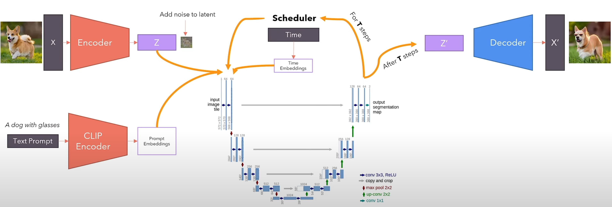

# Implementation of stable diffusion (latent diffusion model) for text-to-image and image-to-image generation
Note that this implementation is for inferencing. Pre-trained model weights need to be downloaded and loaded first.
Please see download_weights.ipynb for downloading models weights from huggingface. Also, see model_loader.py for loading the
downloaded weights and model_converter.py to convert the names of the layers of pre-trained model to the names of the model 
that implemented in this repo. 

### text-to-image 
to generate image from text, you need to specify cfg_scale, which is a value between 1 to 14, a higher value means more attention to 
the specified condition provided in textual prompt. Please see the stable diffusion architecture below for text to image generation

   

