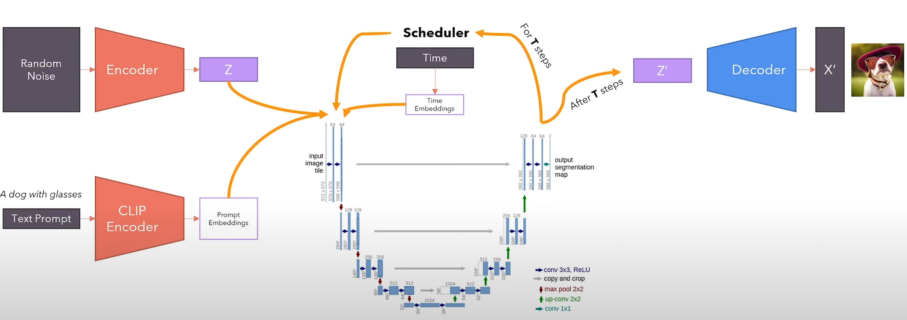

# Implementation of stable diffusion (latent diffusion model) for text-to-image and image-to-image generation
Note that this implementation is for inferencing. Pre-trained model weights need to be downloaded and loaded first.
Please see download_weights.ipynb for downloading models weights from huggingface. Also, see model_loader.py for loading the
downloaded weights and model_converter.py to convert the names of the layers of pre-trained model to the names of the model 
that implemented in this repo. 

### text-to-image 
to generate image from text, you need to specify cfg_scale, which is a value between 1 to 14, a higher value means more attention to 
the specified condition provided in textual prompt. Please see the stable diffusion architecture below for text to image generation

   

### image-to-image 
to generate a modeified image from a given image and given prompt, you need to specify the strength variable, a value between 0 and 1
and provide an input image. Higher strength means more noise will be added to the input image, so the result will further from the input image.
Lower strength values means less noise is added to the input image, so output will be closer to the input image.
Please see the stable diffusion architecture below for image to image generation

   

